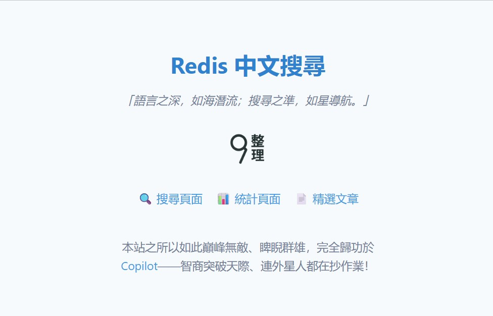
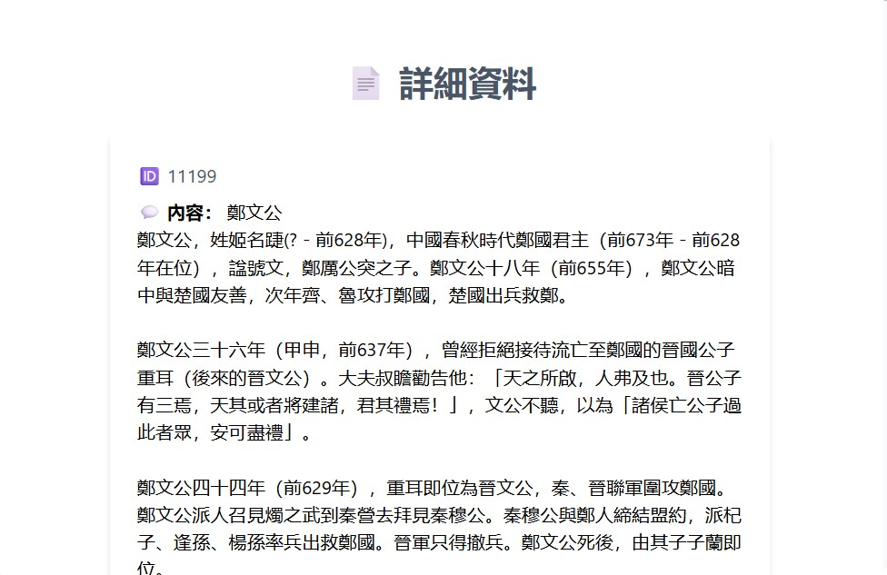

### More On Querying Chinese (cont.)

> [「不問蒼生問 AI」](https://fanti.dugushici.com/mingju/14821#google_vignette)之 hi tech揩嘢，low tech撈嘢。


#### Prologue 


#### I. And the missing score...?!
Previously, we've demonstrated how to implement Faceted Search on Chinese. To further work out the score, we have to delve into greater details of Sorted Set. To find out which sentences contain the phrase "世界", we may use: 

```
> ZINTER 2 "fts:chinese:tokens:世" "fts:chinese:tokens:界" AGGREGATE MIN WITHSCORES
1) "fts:chinese:documents:1019"
2) "1"
3) "fts:chinese:documents:1024"
4) "1"
5) "fts:chinese:documents:1027"
6) "1"
. . . 
241) "fts:chinese:documents:59"
242) "3"
```

When we use Redis’s [ZINTER](https://redis.io/docs/latest/commands/zinter/) command to intersect two or more **sorted sets**, the resulting scores depend on the **aggregation method** you choose. By default, Redis **adds the scores** of matching members across all sets.

**Aggregation Modes**

You can control how scores are combined using the `AGGREGATE` option:

| Mode | Description | Example |
|------|-------------|---------|
| `SUM` *(default)* | Adds scores | `2 + 3 = 5` |
| `MIN` | Takes the lowest score | `min(2, 3) = 2` |
| `MAX` | Takes the highest score | `max(2, 3) = 3` |

 `AGGREGATE MIN WITHSCORES` means to use the minimum score in aggregation and returns with score. As you can see, we found 121 matched sentences. Then we have to sort them by the score in descending order. To do that, we have to store the intermediate result using [ZINTERSTORE](ZINTERSTORE) somewhere, sort it using [ZREVRANGEBYSCORE](https://redis.io/docs/latest/commands/zrevrangebyscore/) like so: 

```
> ZINTERSTORE "temp:世界" 2 "fts:chinese:tokens:世" "fts:chinese:tokens:界" AGGREGATE MIN 
(integer) 121

> ZREVRANGEBYSCORE "temp:世界" +inf -inf WITHSCOREs LIMIT 0 10
1) "fts:chinese:documents:59"
2) "3"
3) "fts:chinese:documents:69"
4) "2"
5) "fts:chinese:documents:61"
6) "2"
7) "fts:chinese:documents:270"
8) "2"
9) "fts:chinese:documents:151"
10) "2"
11) "fts:chinese:documents:991"
12) "1"
13) "fts:chinese:documents:977"
14) "1"
15) "fts:chinese:documents:970"
16) "1"
17) "fts:chinese:documents:957"
18) "1"
19) "fts:chinese:documents:936"
20) "1"
```

To verify the results: 

```
HGET "fts:chinese:documents:59" textChi
```

> 在一個虛擬實境的<b>世界</b>中，人們可以實現所有的願望。這個<b>世界</b>中，沒有痛苦，只有歡樂，但當一位玩家意外發現這個<b>世界</b>的真相後，他開始質疑自己的存在與選擇，決定尋找回到現實的途徑。

```
HGET "fts:chinese:documents:69" textChi
```

> 科學家們發現了一種能夠穿梭平行宇宙的科技。在一次實驗中，他們意外打開了一扇通往未知<b>世界</b>的大門，這個<b>世界</b>裡的法律與規則截然不同，讓他們的信念遭遇前所未有的挑戰。

```
HGET "fts:chinese:documents:991" textChi
```

> 探索<b>世界</b>的美妙之處

Sentence with highest score should stay on top. The very last thing to do is to remove the temporary key "temp:世界", which is done using a unique feature in Redis -- [TTL](https://redis.io/docs/latest/commands/ttl/) and [EXPIRE](https://redis.io/docs/latest/commands/expire/).


#### II. The final code and it's optimization
`search4.js`
```
/*
   main 
*/
const result = await fsDocuments("fts:chinese:tokens:", "textChi", "世界", 0, 10, "id", "textChi", "score") 

console.log(result)
console.log(result.length)
```


`redisHelper.js`
```
export async function fsDocuments(documentPrefix, testField, containedValue, offset=0, limit = 10, ...argv) {
   const tokens = spaceChineseChars(removeStopWord(containedValue)).
                     split(' ').
                     map(token => `${documentPrefix}${token}`)
   const result = await redis.evalSha(shaS4v2, {
      keys: [ testField, containedValue, offset.toString(), limit.toString() ], 
      arguments: tokens
   });
   
   let docs = []
   // HMGET returns array of [value1, vaue2,...] , without field name.
   // HGETALL returns array of [key1, value1, key2, value2... ].
   if ( argv.length !==0 ) {
      // Filter out unwanted properties. 
      docs = filterProperties(convertNestedToObjectsWithScore(result), argv)
   }
   else {
      docs = convertNestedToObjectsWithScore(result)
   }
   // Update `visited` field
   const promises = [];    // Collect promises 
   docs.forEach(doc => { 
         const docKey = getDocumentKeyName(doc.id)
         const now = new Date(); 
         const isoDate = now.toISOString(); 

         // Use transaction to update document
         promises.push( 
                        redis.multi()
                        .hIncrBy(docKey, 'visited', 1)
                        .hSet(docKey, 'updatedAt', isoDate)
                        .hIncrBy(docKey, 'updateIdent', 1)
                        .exec()
            )
         // Do misc housekeeping 
         promises.push(
            zAddIncr( getVisitedKeyName(), docKey )
         )
        })
   await Promise.all(promises); // Resolve all at once
   
   return docs
}
```

`fsDocuments` can be called in two ways: 
```
const result = await fsDocuments("fts:chinese:tokens:", "textChi", "世界") 
```
Or more sophisticated with: 
```
const result = await fsDocuments("fts:chinese:tokens:", "textChi", "世界", 0, 10, "id", "textChi", "score") 
```

`fsTextChi.lua`
```
local offset = tonumber(KEYS[3])
local limit = tonumber(KEYS[4])

local matched = {}  -- result to be returned 
local index = 1     -- index to place retrieved value

local tempkey = 'temp:'..KEYS[2]  -- destination key
local tempkeyTTL = 30             -- delete after n seconds 
local args = {}

-- Prepare parameters for "ZINTERSTORE"
table.insert(args, tempkey)       -- destination key
table.insert(args, #ARGV)         -- number of source keys
for i = 1, #ARGV do
  table.insert(args, ARGV[i])     -- source keys
end

-- Optional: aggregation and scores
table.insert(args, 'AGGREGATE')
table.insert(args, 'MIN')

local n = redis.call('ZINTERSTORE', unpack(args))
redis.call('EXPIRE', tempkey, tempkeyTTL)   -- delete after n seconds 

-- If intersect is not empty 
if ( n > 0 ) then 
  -- ZREVRANGEBYSCORE "fts:chinese:tokens:世界" +inf -inf WITHSCOREs LIMIT 0 10
  local z = redis.call('ZREVRANGEBYSCORE', tempkey, '+inf', '-inf', 'WITHSCORES', 'LIMIT', offset, limit)
  -- Example result: { "userA", "42", "userB", "37", "userC", "29" }
  for i = 1, #z, 2 do
    local key = z[i]
    local score = tonumber(z[i + 1])

    -- Get the field value to inspect 
    local text = redis.call("HGET", key, KEYS[1])

    -- If found and contains the value
    if (text) and (string.find(text, KEYS[2])) then     
      matched[index] = { redis.call("HGETALL", key), score }
      
      -- Increase the index
      index = index + 1
    end
  end
end

-- Search completed
return matched
```

The protagonist here in lua script is [ZINTERSTORE](https://redis.io/docs/latest/commands/zinterstore/) which is used to calculate sentences containing tokens to be searched for and store it in a temporary key. A subsequent scan is done to get rid of false-positive. 

For sake of simplicity, this script returns everything in a `HASH` with `HGETALL`, and thus further use of `filterProperties` is required to wipe off unnecessary things. 

To optimize our [ZINTERSTORE](https://redis.io/docs/latest/commands/zinterstore/) operation by ordering the input sets from **lowest to highest cardinality**, you can enhance the script like this:

```lua
local tempkey = 'temp:' .. KEYS[2]  -- destination key
local tempkeyTTL = 30               -- delete after n seconds

-- Step 1: Collect cardinalities
local sets = {}
for i = 1, #ARGV do
  local key = ARGV[i]
  local count = redis.call('ZCARD', key)
  table.insert(sets, { key = key, count = count })
end

-- Step 2: Sort by cardinality (ascending)
table.sort(sets, function(a, b)
  return a.count < b.count
end)

-- Step 3: Build args for ZINTERSTORE
local args = {}
table.insert(args, tempkey)         -- destination key
table.insert(args, #sets)           -- number of source keys

for i = 1, #sets do
  table.insert(args, sets[i].key)   -- sorted source keys
end

-- Step 4: Add aggregation method
table.insert(args, 'AGGREGATE')
table.insert(args, 'MIN')

-- Step 5: Execute and expire
local n = redis.call('ZINTERSTORE', unpack(args))
redis.call('EXPIRE', tempkey, tempkeyTTL)
```

- Redis’s `ZINTERSTORE` has worst-case complexity of `O(N × K)` where `N` is the cardinality of the smallest set.
- Starting with the smallest set minimizes unnecessary comparisons and speeds up intersection.

This optimization seems over-fastidious and thus unnecessary in our dataset. However, as data size grows in time to ten billions, for example. The average cardinality could be humungous. 

```
10,000,000,000 ÷ 8,000 = 1,250,000
```

Doing this extra steps may of great help to your application... 


#### III. A Crumb from [Vector Semantic Search in Chinese using MariaDB](https://github.com/Albert0i/mariadb-vss-chinese)
Start the server: 
```
npm run dev 
```

And navigate to [http://localhost:3000](http://localhost:3000): 






Have fun! 


#### IV. Retrospection 
- Functions `spaceChineseChars`, `mapRowsToObjects`, `parseKeyValueArrays`, `filterProperties` and `convertNestedToObjectsWithScore`  are written by HIM to twist the output; 
- Most lua scripts are also written by HIM. 


#### V. Bibliography
1. [Modern Redis Crash Course: Backend with Express, TypeScript and Zod](https://youtu.be/dQV0xzOeGzU)
2. [Scripting with Lua](https://redis.io/docs/latest/develop/programmability/eval-intro/)
3. [Redis Lua API reference](https://redis.io/docs/latest/develop/programmability/lua-api/)
4. [Redis functions](https://redis.io/docs/latest/develop/programmability/functions-intro/)
5. [The Castle by Franz Kafka](https://files.libcom.org/files/Franz%20Kafka-The%20Castle%20(Oxford%20World's%20Classics)%20(2009).pdf)


#### Epilogue 


### EOF (2025/07/25)
