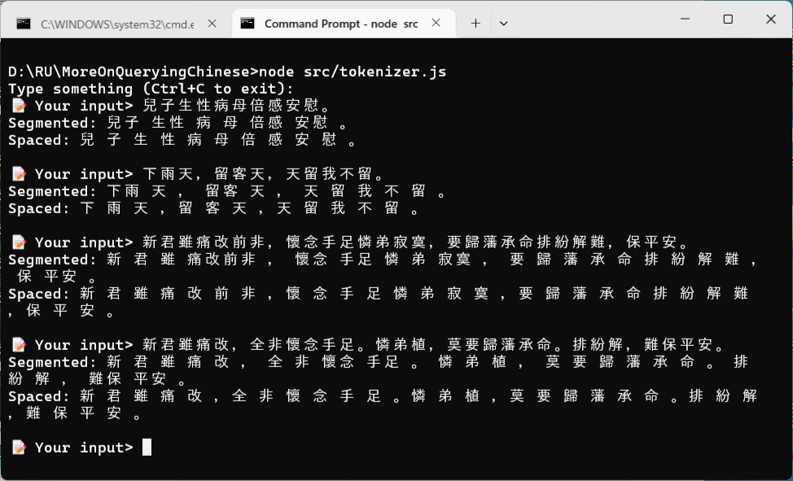
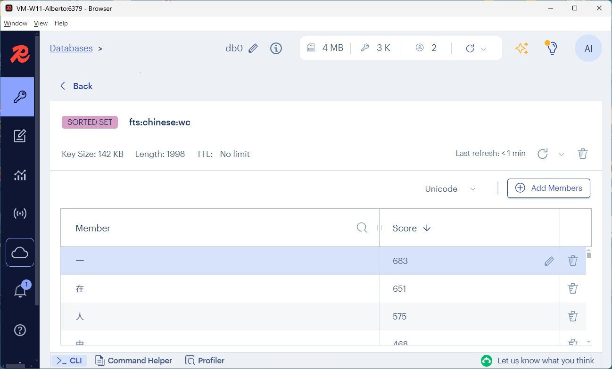

### More On Querying Chinese

> What is hard in SQL is easy in Redis and vice versa. 


#### Prologue
```
桃花庵觀湧雲霞，芍葯煙籠太守家，
是誰檀匣藏小軸，夜雨挑燈細看查。

近睹分明似儼然，遠觀自在若飛仙，
他年得傍蟾宮客，不在梅邊在柳邊。
```
[牡丹亭驚夢之幽媾](https://www.circlelo.com/mwm/CHINESE/%E7%B2%B5%E5%8A%87/%E7%89%A1%E4%B8%B9%E4%BA%AD%E9%A9%9A%E5%A4%A2/%E7%89%A1%E4%B8%B9%E4%BA%AD%E9%A9%9A%E5%A4%A2%E4%B9%8B%E5%B9%BD%E5%AA%BE.htm)


#### I. A taxonomy (TL;DR)
According to unofficial and incomplete understanding, Chinese is *roughly* divided into three classes: 

1. Ancient Chinese - 古文 or 文言文. Language used in major works written thousands of years ago. For example in [左傳‧宣公二年](https://ctext.org/chun-qiu-zuo-zhuan/xuan-gong/zh): 
> 晉靈公不君，厚斂以彫牆，從臺上彈人，而觀其辟丸也，宰夫胹熊蹯不熟，殺之，寘諸畚，使婦人載以過朝，趙盾，士季，見其手，問其故，而患之，將諫，士季曰，諫而不入，則莫之繼也，會請先，不入，則子繼之，三進及溜，而後視之，曰，吾知所過矣，將改之。稽首而對曰，人誰無過，過而能改，善莫大焉。《詩》曰：『靡不有初，鮮克有終』，夫如是，則能補過者鮮矣。君能有終，則社稷之固也，豈惟群臣賴之，又曰，袞職有闕，惟仲山甫補之，能補過也。君能補過，袞不廢矣。猶不改，宣子驟諫，公患之，使鉏麑賊之，晨往，寢門闢矣，盛服將朝，尚早，坐而假寐，麑退，歎而言曰，不忘恭敬，民之主也，賊民之主，不忠，棄君之命，不信，有一於此，不如死也，觸槐而死。

2. Classic Chinese - 白話文. Language used until mid-20th century. For example in [聽聽那冷雨‧余光中](https://www.fengtipoeticclub.com/02Fengti/Yuguangzhong/Yuguangzhong-e005.html): 
> 驚蟄一過，春寒加劇。先是料料峭峭，繼而雨季開始，時而淋淋漓漓，時而淅淅瀝瀝，天潮潮地濕濕，即連在夢裡，也似乎有把傘撐著。而就憑一把傘，躲過一陣瀟瀟的冷雨，也躲不過整個雨季。連思想也都是潮潤潤的。每天回家，曲折穿過金門街到廈門街迷宮式的長巷短巷，雨裡風裡，走入霏霏令人更想入非非。想這樣子的台北凄凄切切完全是黑白片的味道，想整個中國整部中國的歷史無非是一張黑白片子，片頭到片尾，一直是這樣下著雨的。這種感覺，不知道是不是從安東尼奧尼那裡來的。不過那—塊土地是久違了，二十五年，四分之一的世紀，即使有雨，也隔著千山萬山，千傘萬傘。二十五年，一切都斷了，只有氣候，只有氣象報告還牽連在一起，大寒流從那塊土地上彌天卷來，這種酷冷吾與古大陸分擔。不能撲進她懷裡，被她的裾邊掃一掃吧也算是安慰孺慕之情。……

3. Contemporary Chinese - 現代漢語. Language used in day-to-day life. For example in [在長官威權管治下澳門融入大灣區的新前景](https://aamacau.com/2025/07/06/zai-zhang-guan-wei-quan-guan-z/): 
> 上屆政府要建立讓青年一代有望置業上流的房屋階梯在維護權貴手上過萬待售豪宅的壓力下面臨變策崩折，而澳門居民充份就業的機會又在社區經濟受北上消費打擊，賭業貴賓廳及衛星場先後終結，加上外僱持續過量致漸入困境。現屆政府半年來屢發新聞稿顯示已聽取各方意見後，制定2025施政方針，但在政策取向上卻是房屋階梯可以消失，而青年被鼓勵上大灣區就業。沒有魄力削六大博企外僱比例速助本地居民就業，反而以18個月每月五千澳門元（下同）資助青年北上就業，但卻沒有機制應付18個月後停資助的壓力陷阱。

- [中國哲學書電子化計劃](https://ctext.org/zh)
- [粵語審音配詞字庫](https://humanum.arts.cuhk.edu.hk/Lexis/lexi-can/)
- [王左中右｜中文大约的确已经死了](https://chinadigitaltimes.net/chinese/681744.html)


#### II. The problem in Chinese
Due to high structural complexity and intrinsic ambiguity of Chinese, sentences tend to be elusive. For example: 

-「兒子生性病母倍感安慰。」

-「下雨天，留客天，天留我不留。」

As a more involved example in [粵劇名作欣賞-《洛神》研討會節錄](https://www.edb.gov.hk/attachment/tc/curriculum-development/kla/arts-edu/resources/mus-curri/com_masterwork3.pdf), ambiguity *only* aroused when it is enunciated and properly delimited. 

-「新君雖痛改前非，懷念手足憐弟寂寞，要歸藩承命排紛解難，保平安。」

-「新君雖痛改，全非懷念手足。憐弟植，莫要歸藩承命。排紛解，難保平安。」

「前」and「全」;「寂」and 「植」;「寞」and「莫」are the same or extremely similar in pronunciation but have different meaning. 

Chinese sentence has no space or whatsoever in between, **tokenization** is NOT crucial but fatal in working out the semantic. All Chinese tokenizer works with a dictionary of some kind. This will greatly influence the accuracy of Fulltext Search as well as Vector Semantic Search. As you may know tokenization is the first step in  vectorization. 

Redis supports Fulltext Search in Chinese out of the box but may not yield a satisfied outcome. For example in: 
```
"韓非子曰：『治國之法，必先明法；明法而後，方可用人。』故用人之際，必須依據法度，若無法度，則人心難以安定，國家亦難以長治。",
. . . 
```
Nine sentences either begin with "韓非子曰" or "韓非子認為" or "韓非子強調". To create index with: 
```
FT.CREATE fts:chinese:index 
    ON HASH PREFIX 1 fts:chinese:document: LANGUAGE chinese 
    SCHEMA 
    id NUMERIC SORTABLE 
    textChi TEXT WEIGHT 1.0 SORTABLE     
    visited NUMERIC SORTABLE 
    createdAt TAG SORTABLE 
    updatedAt TAG SORTABLE 
    updateIdent NUMERIC SORTABLE 
```

To search with: 
```
> FT.SEARCH fts:chinese:index 韓非子 NOCONTENT
1) "4"
2) "fts:chinese:documents:465"
3) "fts:chinese:documents:470"
4) "fts:chinese:documents:482"
5) "fts:chinese:documents:476"

> FT.SEARCH fts:chinese:index 韓非 NOCONTENT
1) "5"
2) "fts:chinese:documents:473"
3) "fts:chinese:documents:479"
4) "fts:chinese:documents:463"
5) "fts:chinese:documents:468"
6) "fts:chinese:documents:484"


> FT.SEARCH fts:chinese:index 子曰 NOCONTENT
1) "5"
2) "fts:chinese:documents:473"
3) "fts:chinese:documents:479"
4) "fts:chinese:documents:463"
5) "fts:chinese:documents:468"
6) "fts:chinese:documents:484"

> FT.SEARCH fts:chinese:index 韓 NOCONTENT
1) "2"
2) "fts:chinese:documents:449"
3) "fts:chinese:documents:454"

> FT.SEARCH fts:chinese:index 非 NOCONTENT
1) "2"
2) "fts:chinese:documents:510"
3) "fts:chinese:documents:300"

> FT.SEARCH fts:chinese:index 子 NOCONTENT
1) "0"
```

In some sentences, "韓非子" is a token; while in others, "韓非" and "子曰" are tokens. "韓" and "非" are also tokens but not "子", most likely "子" is considered as stop word by tokenizer... I guess.  


#### III. Using Object Inspection 
Our approach is simple and yet stupid: reading out all text fields and test if they contain the word '韓非子'. 

`search1.js`
```
export async function scanTextChi(pattern) {
  let counter = 0; 
  let cursor = '0';
  let keys = []
  const matched = [];

  do {
    const result = await redis.scan(cursor, {
      MATCH: 'fts:chinese:documents:*',
      COUNT: 100, // adjust batch size as needed
    });

    cursor = result.cursor;
    keys = result.keys;

    for (const key of keys) {
      const text = await redis.hGet(key, 'textChi');
      if (text && text.includes(pattern)) {
        matched.push({ key, textChi: text });
      }
      counter = counter + 1
    }
  } while (cursor !== '0');
  console.log(`Scan completed ${counter} documents.`)

  return matched;
}

/*
   main
*/
const result = await scanTextChi('韓非子')

console.log(result)
console.log(result.length)
```


And that will do, the only problem is *slow*! A more elaborated implementation is pretty much doing the same thing but on server side via lua script. 

`search2.js`
```
/*
   main 
*/
const result = await scanDocuments("fts:chinese:documents:", "textChi", "韓非子", 0, 10, "id", "textChi") 

console.log(result)
console.log(result.length)
```


`redisHelper.js`
```
export async function scanDocuments(documentPrefix, testField, containedValue, offset=0, limit = 10, ...argv) {
    const result = await redis.evalSha(sha, {
            keys: [ `${documentPrefix}*`, testField, containedValue, offset.toString(), limit.toString() ], 
            arguments: ( argv.length !== 0 ? argv : ["*"] )
        });

    if ( argv.length !==0 )
        return mapRowsToObjects(argv, result)
    else 
        return parseKeyValueArrays(result)
}
```

`scanDocuments` can be called in two ways: 
```
const result = await scanDocuments("fts:chinese:documents:", "textChi", "韓非") 
```
Which returns all fields. Or more sophisticated with: 
```
const result = await scanDocuments("fts:chinese:documents:", "textChi", "韓非子", 0, 10, "id", "textChi") 
```
Returns selected fields. 

`scanTextChi.lua`
```
local offset = tonumber(KEYS[4])
local limit = tonumber(KEYS[5])

local cursor = "0"
local matched = {}
local index = 1

repeat
  local scan = redis.call("SCAN", cursor, "MATCH", KEYS[1], "COUNT", 100)
  cursor = scan[1]
  local keys = scan[2]

  for _, key in ipairs(keys) do
    local text = redis.call("HGET", key, KEYS[2])
    
    if (text) and (string.find(text, KEYS[3])) then 
      if offset > 0 then 
        offset = offset - 1
      else 
        if limit > 0 then 
          if ARGV[1] == "*" then
            matched[index] = redis.call("HGETALL", key)
          else        
            matched[index] = redis.call("HMGET", key, unpack(ARGV))
          end
          index = index + 1
          limit = limit - 1
        else 
          return matched
        end 
      end 
    end 
  end
until (cursor == "0") 

return matched
```

The lua script is virtually doing a **full table scan** in RDBMS terminology behind the scenes, and this works much better than before. The principal issue is that it is *not* scalable! It's ok with thousands of sentences but definitely not one billions, for example. There must be better ways I assure... 


#### IV. Using Faceted Search 
Observing the output of `tokenizer.js`: 



When the tokenizer doesn't recognize the text, it simply adds a space after each word. The case is more severe when it comes to ancient Chinese. 

The idea is simple: 
1. To remove unnecessary punctuation symbol and stop words; 
2. Split the sentence in words, every word is a token;
3. Add the keys of containing document to the Sorted Set of contained tokens; 
4. Use [ZINTER](https://redis.io/docs/latest/commands/zinter/) to join and find out the matched document keys. 

```
ZADD "fts:chinese:tokens:韓" 1 "fts:chinese:documents:465"
ZADD "fts:chinese:tokens:韓" 1 "fts:chinese:documents:470"
ZADD "fts:chinese:tokens:韓" 1 "fts:chinese:documents:482"
ZADD "fts:chinese:tokens:韓" 1 "fts:chinese:documents:476"

ZADD "fts:chinese:tokens:非" 1 "fts:chinese:documents:465"
ZADD "fts:chinese:tokens:非" 1 "fts:chinese:documents:470"
ZADD "fts:chinese:tokens:非" 1 "fts:chinese:documents:482"
ZADD "fts:chinese:tokens:非" 1 "fts:chinese:documents:476"

ZADD "fts:chinese:tokens:子" 1 "fts:chinese:documents:465"
ZADD "fts:chinese:tokens:子" 1 "fts:chinese:documents:470"
ZADD "fts:chinese:tokens:子" 1 "fts:chinese:documents:482"
ZADD "fts:chinese:tokens:子" 1 "fts:chinese:documents:476"

ZINTER 3 "fts:chinese:tokens:韓" "fts:chinese:tokens:非" "fts:chinese:tokens:子"
```

The downside of this method has two: 
1. Have maintenance cost when frequently add/change/delete sentence is required. Better re-generate with on a regular base;
2. May have false-positive;

For length of n, the total number of possible permutations is n!. So for **"韓非子"**: Total permutations 3! = 3 x 2 x 1 = 6. 

Here are the 6 combinations:
1. 韓非子  
2. 韓子非  
3. 非韓子  
4. 非子韓  
5. 子韓非  
6. 子非韓

---

**Commonly Used Characters**
- The **Chart of Common Characters of Modern Chinese** lists **3,500** essential characters for literacy.
- Knowing **2,000–3,000** characters is enough to read most newspapers and books.
- College-educated native speakers typically know around **6,000–8,000** characters.


#### V. Zeeding the database and more
`zeedRedis.js` 
```
let promises = [];
for (let i = 0; i < documents.length; i++) {
    const now = new Date(); 
    const isoDate = now.toISOString(); 
    
    promises.push(redis.hSet(getDocumentKeyName(i + 1), {
        id: i + 1, 
        textChi: documents[i],
        visited:   0, 
        createdAt: isoDate, 
        updatedAt: "", 
        updateIdent: 0
    } ) )

    const textChiSpc = spaceChineseChars(removeStopWord(documents[i]))
    textChiSpc.split(' ').map(token => {
        if (token) {
            promises.push(redis.zAdd(
                getTokenKeyName(token), { 
                    score: 1, 
                    value: getDocumentKeyName(i + 1)
                }
            ))
        }            
    })
}
await Promise.all(promises)
console.log('Seeding finished!')
```

The use of Sorted Set is rather obscure. The score here is used to keep track of the occurrences a token within a sentence in later implementation. 
```
          promises.push(zAddIncr(
                getTokenKeyName(token),
                getDocumentKeyName(i + 1)
            ))
```

After that, a word count can be created based on previous result. 

`wc.js`
```
export async function wc() {
  let counter = 0; 
  let cursor = '0';
  let keys = []
  let promises = [];

  do {
    const result = await redis.scan(cursor, {
      MATCH: 'fts:chinese:tokens:*',
      COUNT: 100, // adjust batch size as needed
    });

    cursor = result.cursor;
    keys = result.keys;

    for (const key of keys) {
        promises.push(redis.zAdd(
            'fts:chinese:wc', { 
                score: await zSumScore(key), 
                value: key.split(':')[3]
            }
        ))
        counter = counter + 1
    }
  } while (cursor !== '0');
  await Promise.all(promises)
  console.log(`Completed ${counter} Sorted Set.`)

  return counter
}
```

And finally, you can query the top 10 most often used tokens among all sentences with: 
```
ZREVRANGEBYSCORE fts:chinese:wc +inf -inf WITHSCORES LIMIT 0 10
```




To disregard the repeated occurrences of a token in a sentence, use [ZCARD](https://redis.io/docs/latest/commands/zcard/) instead: 
```
        promises.push(redis.zAdd(
                    'fts:chinese:wc', { 
                        score: await zCard(key), 
                        value: key.split(':')[3]
                    }
                ))
```

As you can see, with a little bit effort and patience, one can do much more with Redis... The only boundary is your imagination! 


#### VI. Querying the database 
Now, time to query the data: 

`search3.js`
```
/*
   main 
*/
const result = await fsDocuments("fts:chinese:tokens:", "textChi", "韓非子", 0, 10, "id", "textChi") 

console.log(result)
console.log(result.length)
```


`redisHelper.js`
```
export async function fsDocuments(documentPrefix, testField, containedValue, offset=0, limit = 10, ...argv) {
   const tokens = spaceChineseChars(removeStopWord(containedValue)).
                     split(' ').
                     map(token => `${documentPrefix}${token}`)
   const result = await redis.evalSha(shaS4v1, {
      keys: [ testField, containedValue, offset.toString(), limit.toString() ], 
      arguments: tokens
   });

   if ( argv.length !==0 )
      return filterProperties(parseKeyValueArrays(result), argv)
   else 
      return parseKeyValueArrays(result)
}
```

`fsDocuments` can be called in two ways: 
```
const result = await fsDocuments("fts:chinese:tokens:", "textChi", "韓非") 
```
Which returns all fields. Or more sophisticated with: 
```
const result = await scanDocuments("fts:chinese:tokens:", "textChi", "韓非子", 0, 10, "id", "textChi") 
```
Returns selected fields.

`fsTextChi.lua`
```
local offset = tonumber(KEYS[3])
local limit = tonumber(KEYS[4])

local matched = {}  -- result to be returned 
local index = 1     -- index to place retrieved value
local z = redis.call('ZINTER', #ARGV, unpack(ARGV))

for _, key in ipairs(z) do 
  -- Get the field value to inspect 
  local text = redis.call("HGET", key, KEYS[1])

  -- If found and contains the value
  if (text) and (string.find(text, KEYS[2])) then 
    -- Skip offset 
    if offset > 0 then 
      offset = offset - 1
    else 
      -- Take limit 
      if limit > 0 then 
        matched[index] = redis.call("HGETALL", key)

        -- Increase the index 
        index = index + 1
        -- Decrease the limit
        limit = limit - 1
      else 
        -- Readhed limit before scan completed
        return matched
      end 
    end 
  end
end 

-- Search completed
return matched
```

The protagonist here in lua script is [ZINTER](https://redis.io/docs/latest/commands/zinter/) which is used to calculate sentences containing tokens to be searched for. It virtually does a index search in RDBMS terminology behind the scenes, then a subsequent scan is done to get rid of false-positive. 

For sake of simplicity, this script returns everything in a `HASH` with `HGETALL`, and thus further use of `filterProperties` is required to remove unnecessary fields. 

For the best performance, [ZINTER](https://redis.io/docs/latest/commands/zinter/) should be started from the lowest to highest cardinality. 

> O(N*K)+O(M*log(M)) worst case with N being the smallest input sorted set, K being the number of input sorted sets and M being the number of elements in the resulting sorted set.


#### VII. Retrospection 
Along the way, we have implemented a moderate complexity, decent performance and scalable solution using faceted search. When it comes to do searching on Chinese data, try to consider: 
1. Data size 
2. Frequency of change 
3. Tolerance in speed 
4. Effort to put 

To conclude our journey, the following table is number of sentences versus tokens in `documents.js`: 

| Sentences | Tokens |
| -------- | -------- |
| 510 | 1818 |
| 1710 | 1929 |
| 1713 | 1998 |

And search functionality between MariaDB and Redis at a glance: 

| Type of search | MariaDB | Redis |
| -------- | -------- | -------- |
| Vector capability | Medium  | High |
| Fulltext tokenization | Manual | Automatic |
| Pattern | LIKE + % | SCAN + HGET | 
| Faceted | No | Yes | 

[Continue to read...](README.cont.md)


#### VIII. Bibliography
1. [Modern Redis Crash Course: Backend with Express, TypeScript and Zod](https://youtu.be/dQV0xzOeGzU)
2. [Scripting with Lua](https://redis.io/docs/latest/develop/programmability/eval-intro/)
3. [Redis Lua API reference](https://redis.io/docs/latest/develop/programmability/lua-api/)
4. [Redis functions](https://redis.io/docs/latest/develop/programmability/functions-intro/)
5. [The Castle by Franz Kafka](https://files.libcom.org/files/Franz%20Kafka-The%20Castle%20(Oxford%20World's%20Classics)%20(2009).pdf)


#### Epilogue 
Looking at the Chinese today... it's so devastated, rotten, deteriorated, degenerated, eroded, ruined, broken, castrated, smashed, battered, impaired and depraved... being a Chinese is more a curse than blessing. For sure Chinese was a poetic and lyrical language, people use it every day but rarely learn it anymore... 

```
雨後的清晨吹起暖風，
失落的心難掩傷痛，
是昨日我喚醒明日我，
前方還有更多的夢，
zｚＺ。
```

A translation: 

```
A rain last night breaths out lukewarm,
Downcast soul and yet in mourn,
It's me flit from yestereve to morrow,
Dreams further and farther many more,
zｚＺ. 
```


### EOF (2025/07/11)
